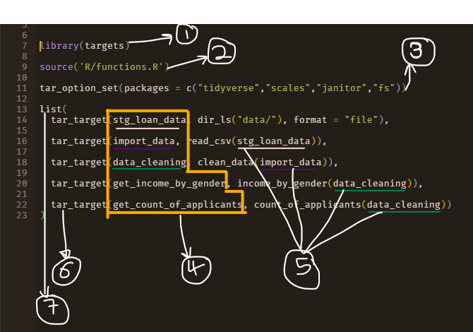
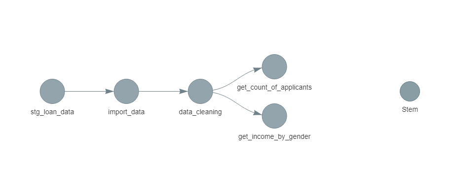
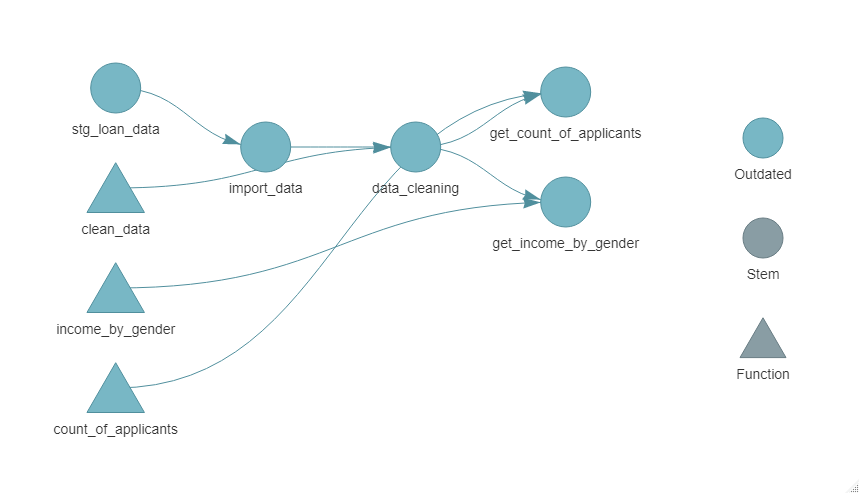
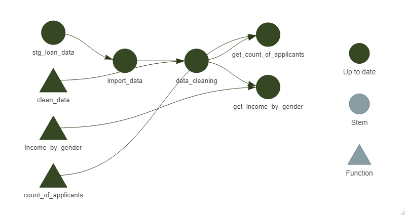
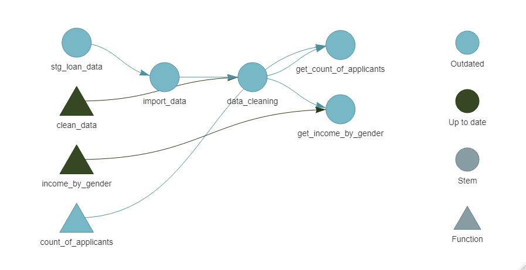

```{r setup, include=FALSE}
knitr::opts_chunk$set(echo = TRUE, message = FALSE, warning = FALSE, tidy = "styler", out.width = '100%')

library(showtext)

font_add_google(name = "quicksand",  family = "quicksand")
showtext_auto()
```

Imagine you have data staged somewhere, either on your local or the cloud and you'd want to perform the following operations.

-   Load the Data in R.

-   Perform some data cleaning/ wrangling steps.

-   Create some Visualizations.

For the sake of this write-up, let us also assume that this is your everyday routine at the office.

"Pre-targets" me would whip up a smart-looking R Markdown file and write some codes to perform these tasks. Well, that's fine BUT, is that the most efficient way to go?

If you haven't figured out where I'm driving at, well, allow me to introduce you to the `{targets}` package. I'm quite new to this package but having it among your R-senal is the way to go 🔥

How would the targets package be better, you ask.

> The `{targets}` package is a Make-Like pipeline toolkit for statistics and data science in R.
>
> It ensures workflow reproducibility.

Let's understand the `{targets}` package with an example.

From the situation stated at the beginning of this post, we would simply break the entire process into chunks and convert each chunk into an R function that would be used to create the targets pipeline or DAG.

## Working with {targets}

Our data is staged locally in a file called data, we'd want to load the .csv file with the `read_csv()` function from `{readr}` package.

```{r}

library(tidyverse)

df <- read_csv("data/loan_data.csv")

head(df)
```

Next we'd want to clean up the data by converting its columns to snake case and changing some columns to factor variables.

```{r}
df <- df %>%
  janitor::clean_names() %>%
  mutate_at(c("gender","dependents","education",
                "loan_status", "property_area", "gender",
                "married", "self_employed", "credit_history"),factor) %>%
  drop_na()

head(df)
```

Next, we'd want to know the median income for each gender and educational class.

```{r}
df %>% 
    count(gender,education , wt = median(applicant_income)) %>% 
    ggplot(aes(gender, n, fill = education)) +
    geom_col(position = position_dodge2(), width = 0.75) +
    geom_hline(yintercept = median(df$applicant_income),
               lty = 2, col = "gray50") +
    annotate("text", x = 2.3,
             y = median(df$applicant_income) + 0.05 * median(df$applicant_income), 
             label = "Median Salary") +
    scale_y_continuous(labels = scales::dollar) +
    labs(
      title = "\nMedian Salary of Loan Applicants",
      y = "Median Salary",
      x = "",
      fill = ""
    ) +
    theme_minimal() +
    theme(
      legend.position = "bottom",
      plot.title = element_text(hjust = 0.5, size = 16),
      text = element_text("quicksand")
    ) +
    guides(
      fill = guide_legend(label.position = "bottom",
                          keywidth = unit(25, "mm"),
                          keyheight = unit(2.5, "mm"))
    )
```

Next, we'd want to know the number of loan applicants and their status

```{r}
df %>% 
    count(loan_status) %>% 
    ggplot(aes(loan_status, n)) +
    geom_col() +
    labs(
      title = "\n Overview of Loan Status",
      y = "# of Candidates",
      x = "Loan Status"
    ) +
    theme_minimal() +
  theme(
    text = element_text("quicksand"),
    plot.title = element_text(size = 16)
  )
  
```

Writing all these in an R Markdown file and running it chunk by chunk any time you want to preprocess the data might not seem to be a big task in this case since the processes involved are quite small. But, imagine a case where you have to run many chunks of codes. Sometimes, some chunks can only run after a particular variable/object in a separate chunk has run. If you sometimes have a scattered RMarkdown file like me, you would see that going this way won't be so effective.

`{targets}` to the rescue!

The best way to use the `{targets}` package is to convert all the stages into functions. i.e. A function to read the data in, a function for data cleaning, a function to create the first plot and finally a function for the second plot. In total we'd be building 3 functions, `read_csv()` is sufficient to load the csv file in this case.

I'm assuming you already know how to create functions in R, so I'll be skipping this step but you check out my [GitHub Repo](https://github.com/EmmanuelUgo/targets-intro "Link to the repo for this tutorial") for the functions and the entire scripts. The functions will be created in a new R Script called 'R/functions.R'.

Now let's dig into building the pipeline.

To create a target script, we run the function

```{r results='hide'}
# targets::tar_edit()
```

In this new script, we have the below contents.



1.  We load in the targets library, you can easily install the library using `install.packages("targets")`
2.  We want to import the functions we created earlier into this target script.
3.  `tar_option_get()` is used to set default arguments to the `tar_target()` function, in this case, we are telling it about the libraries we'd be using to run this pipeline.
4.  The values passed in here are the names of the objects/targets we are creating. Think of this as the way you'd create a variable in R. *'stg_loan_data'* is the name of the variable we are assigning to the path where our data is stored and *'import_data'* is the name of the variable we are assigning when we load the data located at *'stg_loan_data'* and so on. Can you notice some dependencies?
5.  From the explanation in (4), you'd notice that we are applying the functions to the name of the object we created in the target script.
6.  In the `tar_target()` function, we pass the name of the object and the command we want to pass to that object. An extra argument, *format = "file"*, was declared in the first pipeline and it's because we are importing a file into the pipeline.
7.  Finally, all `tar_target()` functions have to be created in a list.

After this, we save the file and we are ready to run this script.

To inspect the targets, we use the function

```{r results='hide'}
# targets::tar_glimpse()
```



or

```{r results='hide'}
# targets::tar_visnetwork()
```



As we can see, the target scripts created a DAG of our workflow. With this, we don't have to worry about dependencies and what code to run before which and all that. The blue-ish colour shows that the DAG is outdated, meaning that it hasn't been refreshed or run.

To run this DAG, we run this

```{r results='hide'}
# targets::tar_make()
```

Running `targets::tar_visnetwork()` after `targets::tar_make()` would produce this.



Now, all nodes are green meaning that everything has been run successfully.

Imagine a situation where new data is added to the staging location and we change the command for the '*count_of_applicants'* object, what do you think would happen to the DAG?

It would look like this 👇



Changing the functions for the count_of_applicants object or updating the file in the staging zone would make the stem outdated and automatically every dependent stem would be outdated. Now, we didn't change anything in the 'clean_data' and 'income_by_gender' objects, they still stay updated and when we `targets::tar_make()` the pipeline, it skips those **Up to date** stems which would save us some computing time if those processes originally took some time to run.

## Some Important TakeAways

1.  `{targets}` ensure workflow reproducibility.
2.  `{targets}` remembers the relationship between functions, files, and objects and the order in which they operate. This means that once a root stem is made and is up to date, the values from other dependent stems won't change and would be skipped when next you build the pipeline, which in turn could save you some computational time.

Since `{targets}` creates a pipeline, can we build a Data Engineering pipeline using the `{targets}` package? I'd explore that in my next article.

Of course, this article doesn't cover all the amazing-ness of the `{targets}` package. If you'd like to learn more about this package, I'd leave some resources I found valuable when learning below.

1.  The targets R Package User Manual, *Will Landau*: <https://books.ropensci.org/targets/>
2.  Hit your reproducibility {targets}: <https://www.rostrum.blog/2020/09/27/targets-dsfest/>
3.  Reference website: <https://docs.ropensci.org/targets/>
